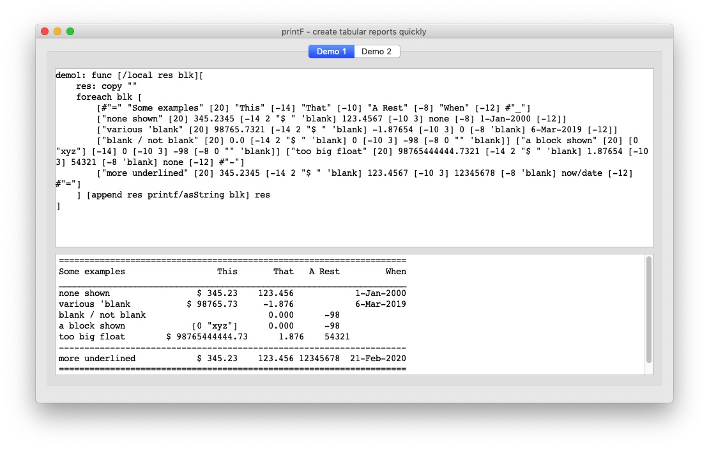

# printF
 tabular printing in red
 

```
USAGE:
     PRINTF b

DESCRIPTION: 
     print ( value [width decs prefix 'blank] ) pairs contained in a block. 
     PRINTF is a function! value.

ARGUMENTS:
     b            [block!] {leading / trailing char! creates above / below line padded with ch.}

REFINEMENTS:
     /asString    => instead of printing return a string.
``` 
this syntax :
```
Red []

do load %printF.red

foreach blk [
     [#"=" "Some examples" [20] "This" [-14] "That" [-10] "A Rest" [-8 ] "When" [-12] #"_"]
     ["none shown" [] 345.2345 [-14 2 "$ " 'blank] 123.4567 [-10 3] none [-8 ] 2000-1-1 [-12]]
     ["various 'blank" [] 98765.7321 [-14 2 "$ " 'blank] -1.87654 [-10 3] 0 [-8 'blank] 2019-3-6 [-12]]
     ["blank / not blank" [] 0.0 [-14 2 "$ " 'blank] 0 [-10 3] -98 [-8 0 "" 'blank]]
     ["a block shown" [] [0 "xyz"] [-14] 0 [-10 3] -98 [-8 0 "" 'blank]]
     ["too big float" [] 98765444444.7321 [-14 2 "$ " 'blank] 1.87654 [-10 3] 54321 [-8 'blank] none [-12] #"-"]
     ["more underlined" [20] 345.2345 [-14 2 "$ " 'blank] 123.4567 [-10 3] 12345678 [-8 'blank] now/date [-12] #"="]
] [printf blk]  
```

results in:

```
      ====================================================================
      Some examples                  This       That   A Rest         When 
      ____________________________________________________________________
      none shown                 $ 345.23    123.456            1-Jan-2000 
      various 'blank           $ 98765.73     -1.876            6-Mar-2019 
      blank / not blank                        0.000      -98 
      a block shown             [0 "xyz"]      0.000      -98 
      too big float        $ 98765444444.73      1.876    54321              
      --------------------------------------------------------------------
      more underlined            $ 345.23    123.456 12345678  21-Feb-2020 
      ====================================================================
```

